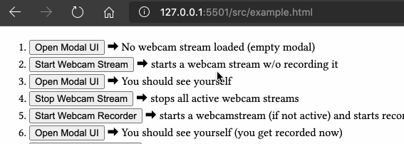

# Silent Recorder &middot; [](https://github.com/ccp-eva/silent-recorder/blob/master/package.json) [](https://www.npmjs.com/package/@ccp-eva/silent-recorder)  [](https://unpkg.com/@ccp-eva/silent-recorder)


> An unobtrusive and DOM-independent JavaScript/npm package that provides utility functions to record a webcam stream using WebRTC.

## About “Silent”

There is no actual *silent* way to access a user’s webcam, which is good. Browser vendors require their users to give explicit consent when a website tries to access a media device. This package is no exception:
<center>

</center>
However, once a user consents to a particular website, a browser may use the allowed media devices at any time. Accessing these devices can happen in the background, in an unobtrusive, silent manner.


## Installation
You can **either** install the npm package:

**`npm`**

```javascript
npm install @ccp-eva/silent-recorder
```

**or** embed the utility functions directly via the `<script>` element using UNPKG CDN.

<br>

**`<script>`**

Put the following line in your HTML file. This will pull the latest version.

```html
<script src="https://unpkg.com/@ccp-eva/silent-recorder" async></script>
```

Note, you can safely use the `async` attribute here, as the required DOM components are included in the js file.

### Offline Support
You can either use the npm version (and a bundler) and start a local server; or, you can copy the JavaScript file from the CDN (i.e., `https://unpkg.com/@ccp-eva/silent-recorder`), and adjust the `src` attribute to point to your location.


## Example
If you clone this repository (or [download and unzip](https://github.com/ccp-eva/silent-recorder/archive/master.zip)), you’ll find an `example.html`, which showcases all utility functions using buttons. If you, locally, want to try the file upload, you need a running PHP server. For local development, I recommend [PHP Server for VS Code](https://marketplace.visualstudio.com/items?itemName=brapifra.phpserver)).

## Usage

Regardless of [how you install](#installation) the package, there are several utility functions you can use:

| Utility Function | Description |
|-|-|
| `toggleModal()` | show/hide the modal UI (if no active stream, you’ll see a blank screen) |
| `startWebcamStream({obj})` | starts a webcam stream w/o recording it |
| `stopWebcamStream()` | stops all active webcam streams |
| `startWebcamRecorder({obj})` | starts a webcam stream (if not active) and starts recording |
| `stopWebcamRecorder()` | stops the recording, creates a video file, stops the webcam stream |
| `playbackRecording()` | opens the modal to view the recording |
| `uploadVideo("filename")` | Uploads the recording using a given "filename". If no argument is provided, the filename defaults to a ISO 8601 timestamp. [See notes about uploading.](#endpoint-for-uploading) |

For `startWebcamStream({obj})` and `startWebcamRecorder({obj})` you can pass a [MediaTrackConstraints Object](https://developer.mozilla.org/en-US/docs/Web/API/MediaTrackConstraints) as an argument, which allows you define what media tracks (e.g., video, audio) should be recorded, and how they should be recorded (e.g., resolution, fps, facing mode). When providing no arguments, both functions default to `{audio: true, video: true}`.  
See https://developer.mozilla.org/en-US/docs/Web/API/MediaDevices/getUserMedia for examples you can provide to both functions.

### Endpoint for Uploading

You need to have a server-side endpoint for this function. Right now, this function only works for PHP.

`upload_video.php`
```php
$target_path = "uploads/" . basename($_FILES["vidfile"]["name"] . ".mp4");
move_uploaded_file($_FILES["vidfile"]["tmp_name"], $target_path );
```


## Development Setup

1. `git clone git@github.com:ccp-eva/silent-recorder.git`
2. `npm install`
3. I’m following ESLint/AirBnB styleguide (see devDependency)
